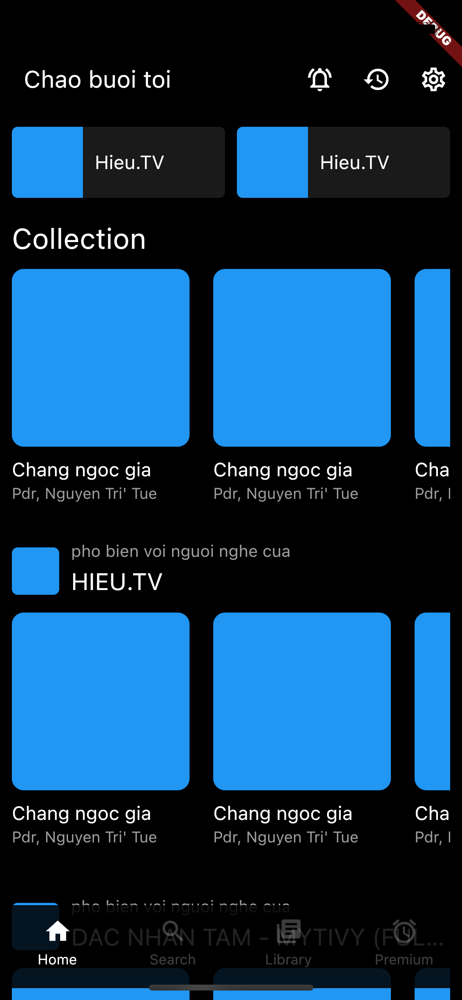
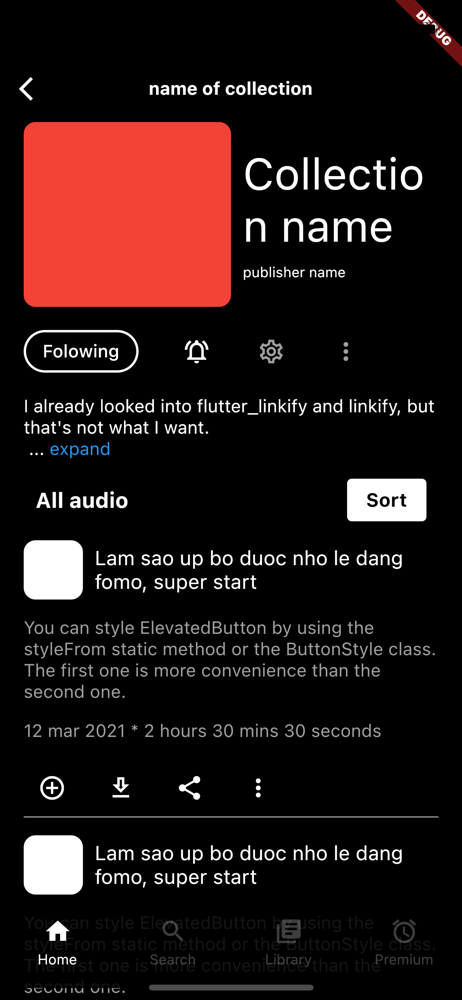
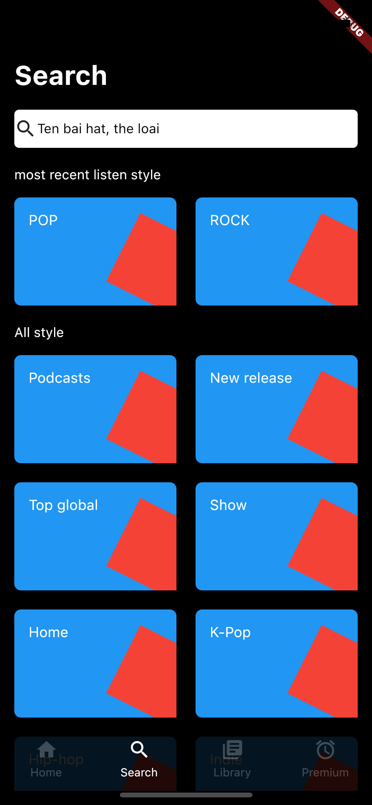
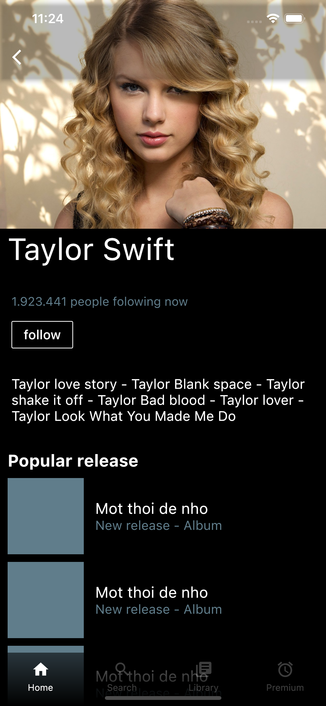

# Project Spotify
Project clone UI of Spotify application

# Screenshots

               
               
              
           

# Technologies use
* Use MultiBloc 
* Use get_it to dependency injection to store Bloc instances.
* Using Overlay view to display Navigation Bar (custom bar by StatefulWidget)
* Use ValueNotifier to show/hide Navigation Bar
* Using method channel to request permission read external storage from Android native then get list songs in device.
